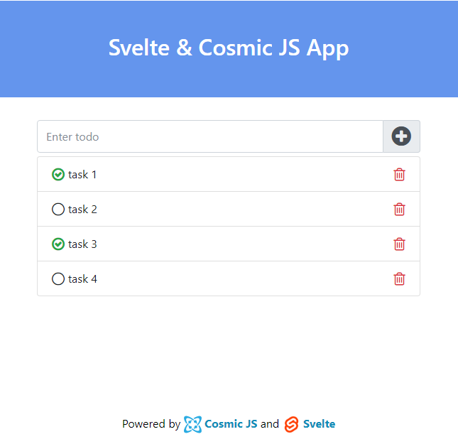

# Svelte + Cosmic JS



> This repo contains an todo app that is built with [Svelte](https://svelte.dev), and [Cosmic JS](https://www.cosmicjs.com).

>[See live demo hosted on Netlify](https://svelte-cosmicjs-app.netlify.com/)

## Prerequisites

- Node (I recommend using v8.2.0 or higher)

## Getting Started

``` bash
git clone https://github.com/sumitkharche/svelte-cosmicjs-app.git
cd svelte-cosmicjs-app
npm install or yarn install
```

### Run
``` bash
npm run dev
```
Open http://localhost:5000.

### Production
``` bash
npm run build
```
